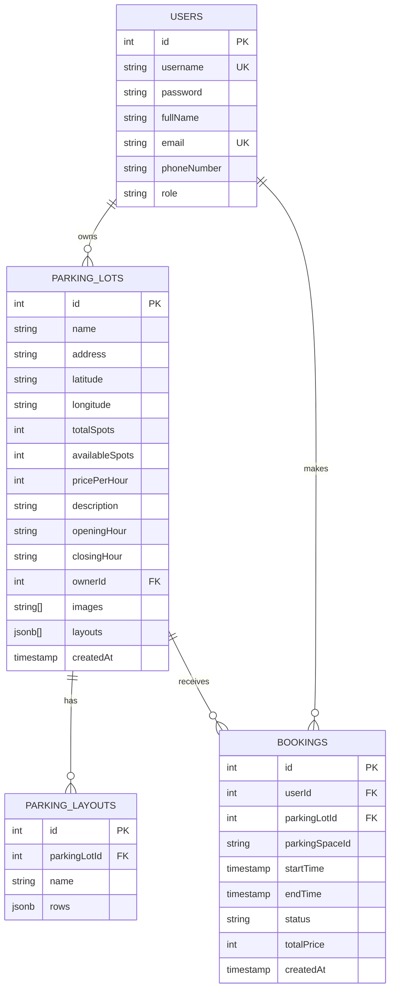

```mermaid
erDiagram
    USERS {
        int id PK
        string username UK
        string password
        string fullName
        string email UK
        string phoneNumber
        string role
    }
    
    PARKING_LOTS {
        int id PK
        string name
        string address
        string latitude
        string longitude
        int totalSpots
        int availableSpots
        int pricePerHour
        string description
        string openingHour
        string closingHour
        int ownerId FK
        string[] images
        jsonb[] layouts
        timestamp createdAt
    }
    
    PARKING_LAYOUTS {
        int id PK
        int parkingLotId FK
        string name
        jsonb rows
    }
    
    BOOKINGS {
        int id PK
        int userId FK
        int parkingLotId FK
        string parkingSpaceId
        timestamp startTime
        timestamp endTime
        string status
        int totalPrice
        timestamp createdAt
    }
    
    USERS ||--o{ PARKING_LOTS : owns
    PARKING_LOTS ||--o{ PARKING_LAYOUTS : has
    USERS ||--o{ BOOKINGS : makes
    PARKING_LOTS ||--o{ BOOKINGS : receives
```